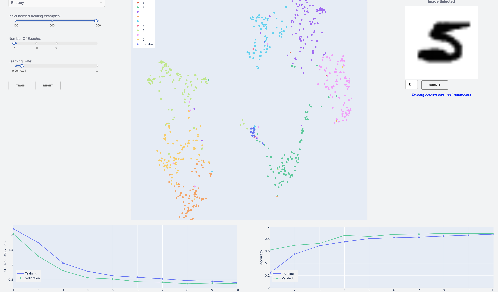

# Active Learning Workflow Demo
> Supervised machine learning, while powerful, needs labeled data to be
effective. Active learning reduces the number of labeled examples needed to
train a model, saving time and money while obtaining comparable performance to
models trained with much more data.   
    
> This application is meant to serve as a complement to the [prototype](https://activelearner.fastforwardlabs.com/) 
for the report we released on Learning with Limited Labeled Data. To build an 
intuition for why active learning works, please see our blogpost - 
[A guide to learning with limited labeled data](https://blog.cloudera.com/a-guide-to-learning-with-limited-labeled-data/) 



## What is Active Learning?
Active learning is an iterative process, and relies on human input to build up a
smartly labeled dataset. The process typically looks like this:

* Begin with a small set of labeled data (that is all we have)
* Train a model 
* Use the trained model to run inference on a much larger pool of unlabeled data 
available to us
* Use a selection strategy to pick out points that are difficult for the machine
* Request labels from human
* Add these back into the labeled datapool
* Repeat the training and labeling process until you have achieved your desired model performance

We use the MNIST dataset to illustrate the active learning workflow. To start, 
we train a convolutional neural network using only a few labeled datapoints. 
You can kick off training by selecting appropriate hyperparameters and clicking 
on the "TRAIN" button. Once the model has completed training, you can visualize 
the embeddings of the convolutional neural network by using UMAP to project the 
high dimensional representation down to 2D. 

## Structure
```
.
├── activelearning        # active learning scripts
├── apps                  # Dash application
├── assets                # Dash related stylesheets
├── cml                   # contains scripts that facilitate the project launch on CML
├── data                  # contains MNIST data.
├── docs                  # images/ snapshots for README
├── experiments           # contains a script that demonstrates the use of AL functions
```
The `assets`, `data`, and `docs` directories are unimportant and can be ignored. 

### `activelearning`
```
activelearning
├── data.py               # loads train and validation data
├── dataset.py            # MNIST dataset handler
├── model.py              # Neural network architecture
├── sample.py             # defines random, entropy and entropy dropout selection strategies
└── train.py              # helper functions for model training, generating embeddings and predictions, computing metrics, checkpointing, saving results in text file and so on
```

### `apps` 
```
apps
├── app.py
├── demo.py 
├── demo_description.md
├── demo_intro.md
```
These scripts leverage the stylesheets from the `assets` folder to provide a UI for:
- training a model based on the user selected hyperparameters,
- visualize the trained embeddings using UMAP
- visualize model performance metrics on trains and validation sets
- and request labels for 10 selected datapoints from the user to retrain the model
- the final model is saved in the "/models" directory for future use

### `data`
```
data
├── MNIST
```
The project uses the [MNIST dataset](http://yann.lecun.com/exdb/mnist/) to illustrate 
the AL workflow. It uses only the 10k testing dataset as the entire dataset. 
- First set aside 2,000 datapoints for validation/testing
- Out of the remaining 8,000 datapoints, allow the user to select 100, 500 or 1,000 as 
initial labeled examples while the rest are unlabeled. 
- The user can then provide labels for the 10 shortlisted examples (based on the selection strategy) from the 
remaining training examples and continue to train a model with the additional data 
points. 
- In the long run the model performance differs based on the selection strategy employed.

### `experiments`
```
experiments
├── main.py               # code to experiment and test data and model functions w/o UI
```
Note: You still need to go through the installation process below to be able to run this code

## Deploying on CML

There are three ways to launch this project on CML:

1. **From Prototype Catalog** - Navigate to the Prototype Catalog on a CML workspace, select the "Active Learning" tile, click "Launch as Project", click "Configure Project"
2. **As ML Prototype** - In a CML workspace, click "New Project", add a Project Name, select "ML Prototype" as the Initial Setup option, copy in the [repo URL](https://github.com/cloudera/CML_AMP_Active_Learning), click "Create Project", click "Configure Project"
3. **Manual Setup** - In a CML workspace, click "New Project", add a Project Name, select "Git" as the Initial Setup option, copy in the [repo URL](https://github.com/cloudera/CML_AMP_Active_learning), click "Create Project". Then, follow the installation instructions below.

### Installation
The code and applications were developed using Python 3.6.9, and are likely also to function with more 
recent versions of Python. 

To install dependencies, first create and activate a new virtual environment through your preferred means, 
then pip install from the requirements file. We recommend:

```python
python3 -m venv .venv
source .venv/bin/activate
pip install -r requirements.txt
```

In CML or CDSW, no virtual env is necessary. Instead, inside a Python 3 session 
(with at least 4 vCPU / 6 GiB Memory), simply run

```python
!pip3 install -r requirements.txt     # notice `pip3`, not `pip`
```

#### Starting the application as a normal python session
- First, specify the port in app.py by uncommenting the lines for `normal python session`
  ```
  # for normal python session uncomment below
  server = app.server
  
  # Running server
  if __name__ == '__main__':
    # for running on CDSW / CML uncomment below
    # app.run_server(port=os.getenv("CDSW_APP_PORT"))
    # OR 
    # for normal python session uncomment below
    app.run_server(debug=True)
  ```
- Run
  ```
  python app.py
  ```

#### Starting the application within CML or CDSW
- First, specify the port in app.py. 
  ```
  # for normal python session uncomment below
  # server = app.server
  
  # Running server
  if __name__ == '__main__':
    # for running on CDSW / CML uncomment below
    app.run_server(port=os.getenv("CDSW_APP_PORT"))
    # OR 
    # for normal python session uncomment below
    # app.run_server(debug=True)
  ```
- Second, set the subdomain in CDSW's Applications tab.
- Third, enter app.py in the Script field in CDSW's Applications tab.
- Fourth, start the application within CDSW.
- Finally, access demo at `subdomain.ffl-4.cdsw.eng.cloudera.com`